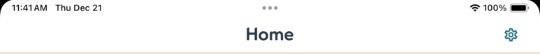

_`@equinor/mad-core` is a package made for the mad team in Equinor. It is opinionated and will not
work well for other teams. If you work in Equinor and would like to use this package, please contact
us!_

### Introduction

`@equinor/mad-core` is designed to handle the general requirements for your react native app, so
that you can focus on your app's core functionality. It provides:

-   Authentication system, including a login screen and easy authentication for your needs
-   Release notes. No need to worry about displaying release-notes. `mad-core` handles everything
    for you. If the app version is greater than the last time the user used it, a "What's
    New"-screen will be displayed automatically.
-   Language support. If you set your app to support multiple languages, the app will prompt the
    user to select language. Language will also be provided as a setting in the Settings screen if
    multiple languages are supported.
-   Settings Screen. The Settings Screen will provide a lot of your common needs, depending on your
    config. Your app-specific needs should also be easy to add.
-   Application Insights tracking. We provide methods for tracking events in your app. We have also
    added tracking to some of our screens, a `NavigationContainer` you can use to automatically
    track navigation, and a `ErrorBoundary` you can use for user-friendly crash handling, as well as
    crash tracking.
-   Service Message. Any planned maintenance? Just create a service message in the service portal,
    and the message will be displayed in the app automatically.
-   Environment banner. Don't know which environment you're in? Don't worry, we will display the
    information to you
-   About screen. Detailed information about the app. App version, environment endpoints, etc. Wow!
    Amazing!
-   Create incident screen. For creating a new incident in service-now. Available in a
    settings-screen near you!
-   Probably more, but it's hard to keep track of everything. Do you know of anything that should be
    added here? Create an issue!

### Implementation

_note: this package is new. Expect bugs. Expect lacking documentation. If you have any issues,
PLEASE create an issue. We want to make this great, but it's impossible to make it great without
your input_

#### Step 1: Installation

Install `react-native-msal` from [this repository](https://github.com/equinor/react-native-msal/).
This is a fork maintained by the mad-team. Always install the newest commit. To install it, add this
to your `package.json`:

```json
"dependencies": {
    "react-native-msal": "github:equinor/react-native-msal#NEWEST_COMMIT_HASH_HERE",
}
```

And then run `npm install`.

Next, install `@equinor/mad-core` and it's peer dependencies
`@react-native-async-storage/async-storage`, `@react-navigation/native`, and
`react-native-gesture-handler`. _note: Any issues with installation? Do you suspect some
peer-dependencies are missing? Create an issue!_

#### Step 2: Create a config

Create a `mad.config.ts` file (name of the file can be anything, but we have used this naming
convention when developing this package). Use the `MadConfig` type from `@equinor/mad-core` for type
safety:

```ts
import { MadConfig } from "@equinor/mad-core";
import Splash from "./assets/images/splash.png";
import { getBuildNumber, getAppSpecificEndpoints } from "./settings";
import { RootStackParamList } from "./types/navigation";

export const config: MadConfig<RootStackParamList> = {
    navigateToMainRouteFn: navigation => navigation.navigate("Root"),
    appVersion: "1.0.0",
    servicePortalName: "Chronicles",
    currentEnvironment: "prod",
    language: {
        supportedLanguages: [
            { code: "en", name: "English" },
            { code: "nb", name: "Norwegian" },
            { code: "pt", name: "Portuguese" },
        ],
        skipOnboarding: false,
    },
    authentication: {
        redirectUri: "msauth.com.equinor.mad.chronicles://auth",
        redirectUriWeb: "http://localhost:8081",
        clientId: "49222fe1-4e0a-4310-9e81-1a2c3eb9b2ed",
        scopes: ["0a429637-3fe1-4452-bd95-c87923ba340b/user_impersonation"],
    },
    login: {
        splash: Splash,
    },
    applicationInsights: {
        instrumentationKey: "f1859360-4aa2-425f-b494-2d7320de6832",
        longTermLog: { instrumentationKey: "e91835aa-bcc2-41dd-a79d-352f0df23e1b" },
    },
    serviceNow: "SERVICE_NOW_CONFIGURATION_ITEM",
    about: {
        endpoints: getAppSpecificEndpoints(),
        buildNumber: getBuildNumber(),
    },
};
```

You can also set environment specific values for each field. The config supports `dev`, `test`,
`qa`, `prod`. The correct values will be picked based on `currentEnvironment`. Example from
`Chronicles`:

```ts
import { MadConfig } from "@equinor/mad-core";
import Splash from "./assets/images/splash.png";
import { getBuildNumber } from "./settings";
import { RootStackParamList } from "./types/navigation";

export const config: MadConfig<RootStackParamList> = {
    navigateToMainRouteFn: navigation => navigation.navigate("Root"),
    appVersion: "1.0.0",
    servicePortalName: "Chronicles",
    currentEnvironment: "prod",
    serviceNow: "MAD",
    language: {
        supportedLanguages: [
            { code: "en", name: "English" },
            { code: "nb", name: "Norwegian" },
            { code: "pt", name: "Portuguese" },
        ],
        skipOnboarding: false,
    },
    authentication: {
        prod: {
            redirectUri: "msauth.com.equinor.mad.chronicles://auth",
            redirectUriWeb: "http://localhost:8081",
            clientId: "49222fe1-4e0a-4310-9e81-1a2c3eb9b2ed",
            scopes: ["0a429637-3fe1-4452-bd95-c87923ba340b/user_impersonation"],
        },
        test: {
            redirectUri: "msauth.com.equinor.mad.chronicles://auth",
            redirectUriWeb: "http://localhost:8081",
            clientId: "49222fe1-4e0a-4310-9e81-1a2c3eb9b2ed",
            scopes: ["830a7388-cd89-4e25-a631-bd615bf225a4/user_impersonation"],
        },
    },
    login: {
        splash: Splash,
    },
    applicationInsights: {
        instrumentationKey: "f1859360-4aa2-425f-b494-2d7320de6832",
        longTermLog: { instrumentationKey: "e91835aa-bcc2-41dd-a79d-352f0df23e1b" },
    },
    about: {
        endpoints: [],
        buildNumber: getBuildNumber(),
    },
};
```

| key                   | required? | explanation                                                                                                                                                                                         |
| --------------------- | --------- | --------------------------------------------------------------------------------------------------------------------------------------------------------------------------------------------------- |
| `appVersion`          | true      | Your app's current version. Used to figure out whether the app should display what's new, and which release notes version to fetch                                                                  |
| `navigateToMainFn`    | true      | a function `@equinor/mad-core` will use when navigating to your app's main route. To make this function type safe, make sure to provide a `ParamList` as a generic argument to the `MadConfig` type |
| `servicePortalName`   | true      | The name of the app in the service portal. Used to figure out which release notes and service messages to fetch                                                                                     |
| `currentEnvironment`  | true      | The environment of the app. Used to display environment banner, and to select the correct service message and release notes endpoint. Also used to pick correct values from config                  |
| `language`            | true      | language config. See [language](#language-config)                                                                                                                                                   |
| `authentication`      | true      | authentication config. See [authentication](#authentication-config)                                                                                                                                 |
| `login`               | true      | login screen config. See [login](#login-config)                                                                                                                                                     |
| `applicationInsights` | true      | application insights config. See [application insights](#application-insights-config)                                                                                                               |
| `serviceNow`          | false     | Configuration item in Service Now. Used for create incident screen. If not provided, we won't add create incident screen to the stack                                                               |
| `about`               | false     | about screen config. If not provided, we won't add about screen to the stack. See [about](#about-config)                                                                                            |

###### Language config

| key                   | required? | explanation                                                                                                                                                                                                                                                                                         |
| --------------------- | --------- | --------------------------------------------------------------------------------------------------------------------------------------------------------------------------------------------------------------------------------------------------------------------------------------------------- |
| `supportedLanguages`  | true      | an array of supported languages. The language object should contain `code` and `name`. `mad-core` supports Norwegian (`no`, `nb`), english (`en`) and Portuguese (`pt`). If you use any other languages, the common screens will be in english. If you need more language support, create an issue! |
| `defaultLanguageCode` | false     | The default language of the app. This is the language the app will use if the user has not selected a language. If default language is not provided, the app will use the first language in the `supportedLanguages` array                                                                          |
| `skipOnboarding`      | false     | Set this to true if you don't want to force the user to set their preferred language the first time they start the app                                                                                                                                                                              |

###### Authentication config

| key              | required? | explanation                                                                           |
| ---------------- | --------- | ------------------------------------------------------------------------------------- |
| `clientId`       | true      | The application's client id                                                           |
| `redirectUri`    | true      | The application's redirect uri                                                        |
| `redirectUriWeb` | false     | The application's redirect uri for web. This is required if your app has web support. |
| `scopes`         | true      | an array of scopes to use when logging in                                             |

###### Login config

| key      | required? | explanation                                                                                                                                                                                                                                                                                            |
| -------- | --------- | ------------------------------------------------------------------------------------------------------------------------------------------------------------------------------------------------------------------------------------------------------------------------------------------------------ |
| `splash` | true      | The splash screen of the application. Will be used as a background for the login screen. For best results, set `resizeMode` to `"cover"`, and `backgroundColor` to your splash screen's background color in `app.json`. `@equinor/mad-core` will use resize mode `cover` on iOS, and `contain` on web. |

###### Application Insights config

| key                                        | required? | explanation                                                                                       |
| ------------------------------------------ | --------- | ------------------------------------------------------------------------------------------------- |
| `instrumentationKey` or `connectionString` | true      | used to connect to the right resource in Azure                                                    |
| `longTermLog`                              | false     | used to define long term log config. It should contain `instrumentationKey` or `connectionString` |

###### About config

| key           | required? | explanation                                                                                                                           |
| ------------- | --------- | ------------------------------------------------------------------------------------------------------------------------------------- |
| `endpoints`   | true      | The endpoints used by the application. The endpoints used by `mad-core` is added automatically. Will be displayed at the about-screen |
| `buildNumber` | true      | The build number of the application. Will be displayed at the about-screen                                                            |

#### Step 3: use `createCoreStackNavigator`

Next step is replacing your topmost `createStackNavigator`/`createNativeStackNavigator` with
`createCoreStackNavigator` from `@equinor/mad-core`. It takes one argument: The config you created
in step 2. You use it the same way you would a normal `Stack`.

```tsx
import { createCoreStackNavigator } from "@equinor/mad-core";
import { config } from "path/to/mad.config.ts";
import { RootStackParamList } from "path/to/paramList.ts";

const RootStack = createCoreStackNavigator<RootStackParamList>(config);
```

If you have leftover screens from `mad-expo-core` in the stack, they should be removed.
`createCoreStackNavigator` will add similar screens for you behind the scenes.

`SettingsScreen` also has to be added manually. This is because you most likely have app-specific
settings you want to hook up to the settings screen.

If you don't have any app-specific settings, you can just add `SettingsScreen` from
`@equinor/mad-core` with name `"Settings"`. If you do have app-specific settings you want to add, we
suggest creating a wrapper component that passes in the props you need to `SettingsScreen`.

Example stack:

```tsx
const CoreStack = createCoreStackNavigator<RootStackParamList>(config);
function RootNavigator() {
    return (
        <CoreStack.Navigator>
            <CoreStack.Screen
                name="Root"
                component={BottomTabNavigator}
                options={{ headerShown: false }}
            />
            <CoreStack.Screen
                name="NotFound"
                component={NotFoundScreen}
                options={{ title: "Oops!" }}
            />
            <CoreStack.Screen name="Settings" component={SampleSettingsScreen} />
        </CoreStack.Navigator>
    );
}
```

SampleSettingsScreen:

```tsx
import React from "react";
import { SettingsScreen, SettingsScreenConfiguration } from "@equinor/mad-core";

export const SampleSettingsScreen = () => {
    const appSpecificSettingsConfig: SettingsScreenConfiguration = [
        {
            items: [
                {
                    name: "navigation",
                    title: "navigation",
                    onPress: () => undefined,
                    iconName: "abacus",
                },
                {
                    name: "button",
                    title: "Button",
                    onPress: () => undefined,
                    iconName: "abacus",
                    color: "primary",
                },
                {
                    name: "switch",
                    title: "Test",
                    onChange: () => undefined,
                    isActive: true,
                    iconName: "abacus",
                },
                {
                    name: "custom",
                    key: "Custom",
                    component: () => (
                        <Cell>
                            <Typography>This is a custom setting</Typography>
                        </Cell>
                    ),
                },
            ],
        },
    ];

    return <SettingsScreen config={appSpecificSettingsConfig} />;
};
```

_note: Remember to put your content in a `Cell` when adding custom settings_

#### Step 4: replace `createStackNavigator`/`createNativeStackNavigator`/`createBottomTabsNavigator`/`NavigationContainer` imports

In order for us to display environment banners and service messages on all screens, you need to
import `createNativeStackNavigator`/`createBottomTabsNavigator` from `@equinor/mad-core` instead of
`react-navigation`. Currently we don't support other navigators. Do you need support for other
navigators? Create an issue!

By default environment banners and service messages should display if the screen header is
displayed. If you need to override this behaviour, you can use the `customSubHeaderShown` option.
For more information on using `customSubHeaderShown`, refer to `@equinor/mad-navigation`'s
documentation.

Using `@equinor/mad-core`'s `NavigationContainer` is optional, but it adds application insights
navigation tracking for you automatically, which is a nice feature to have!

```tsx
import {
    createBottomTabNavigator,
    createNativeStackNavigator,
    createCoreStackNavigator,
    NavigationContainer,
} from "@equinor/mad-core";
```

#### Step 5: Implement a way to access the settings screen

How the user navigates to settings, is up to the app itself. One common approach is to add a button
in your main screen's `headerRight` position.

```tsx
import React from "react";
import { Button } from "@equinor/mad-components";
import { useCoreStackNavigation } from "@equinor/mad-core";
import { View } from "react-native";

export type GoToSettingsButtonProps = { marginRight?: number };

export function GoToSettingsButton({ marginRight }: GoToSettingsButtonProps) {
    const navigation = useCoreStackNavigation();
    return (
        <View style={{ marginRight }}>
            <Button.Icon
                name="cog-outline"
                variant="ghost"
                onPress={() => navigation.navigate("Settings")}
            />
        </View>
    );
}
```

Results:

<p align="center">
  
</p>
<br />

#### Step 6 (optional): Add `ErrorBoundary`

`@equinor/mad-core` provides an `ErrorBoundary` component that automatically logs crashes to
Application Insights. It gives the user a more user-friendly crash behaviour, and gives you
information about why the app crashes.

_note: The error boundary might not catch native code related crashes. It should almost always catch
javascript-related crashes, though._

`ErrorBoundary` should be as far up your stack as possible, in `App.tsx`:

```tsx
export default function App() {
    const isLoadingComplete = useCachedResources();
    const colorScheme = useColorScheme();

    if (!isLoadingComplete) {
        return null;
    }
    return (
        <ErrorBoundary>
            <QueryClientProvider client={queryClient}>
                <SpeakUpSessionProvider>
                    <EDSProvider colorScheme="light" density="tablet">
                        <SafeAreaProvider>
                            <Navigation colorScheme={colorScheme} />
                            <StatusBar style="dark" />
                        </SafeAreaProvider>
                    </EDSProvider>
                </SpeakUpSessionProvider>
            </QueryClientProvider>
        </ErrorBoundary>
    );
}
```

#### Step 7: implement `useLanguage`

_note: If your app only supports one language, you can skip this step_

If you have language related state in your app, we recommend removing it, and use `useLanguage` from
`@equinor/mad-core` instead.

```tsx
const { language } = useLanguage();
```

This hook will give you information about which language the app is currently using.

One way to implement this, is to create a `useDictionary` hook, to select which json file to read
static text from.

```tsx
import { useLanguage } from "@equinor/mad-core";
import * as no from "../resources/language/no.json";
import * as en from "../resources/language/en.json";

export const useDictionary = () => {
    const { language } = useLanguage();
    switch (language.code) {
        case "no":
            return no;
        default:
            return en;
    }
};
```

```tsx
const Example = () => {
    const dictionary = useDictionary();
    return <Typography>{dictionary.example}</Typography>;
};
```

While `@equinor/mad-core` should handle language selection for you, you can always add code to
select language by using `setSelectedLanguage` from `@equinor/mad-core`. You also have access to
`getLanguage` and `getIsLanguageSelected`, if you need access to those methods in contexts where the
`useLanguage` hook cannot be used.

#### Step 8: Implement demo mode

Demo mode is handled for you in `@equinor/mad-core`. You should delete your old demo state, and use
`getIsDemoModeEnabled` or `useDemoMode` from `@equinor/mad-core` instead. `@equinor/mad-core` should
handle this state for you. However, if you need access to setting the demo mode state, you can use
`enableDemoMode` and `disableDemoMode`.

#### Step 9: replace imports from `mad-expo-core`

The final step is to replace imports from `mad-expo-core`, and import them from `@equinor/mad-core`
instead. If you want to replace components, you should look for equivalent components in
`@equinor/mad-components`. Otherwise, you should be able to find `authenticateSilently`, and
application insights related items like `track`, `metricStatus`, `metricKeys`,
`addTelemetryInitializer`, etc in `@equinor/mad-core`. If anything is missing, and you think it
should be there, create an issue!
